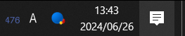

# IODATA UD-CO2S Sensor Data Reader

<p align="center">
  <a href="https://github.com/34j/ud-co2s/actions/workflows/ci.yml?query=branch%3Amain">
    
  </a>
  <a href="https://ud-co2s.readthedocs.io">
    
  </a>
  <a href="https://codecov.io/gh/34j/ud-co2s">
    
  </a>
</p>
<p align="center">
  <a href="https://python-poetry.org/">
    
  </a>
  <a href="https://github.com/ambv/black">
    
  </a>
  <a href="https://github.com/pre-commit/pre-commit">
    
  </a>
</p>
<p align="center">
  <a href="https://pypi.org/project/ud-co2s/">
    
  </a>
  
  
</p>

---

**Documentation**: <a href="https://ud-co2s.readthedocs.io" target="_blank">https://ud-co2s.readthedocs.io </a>

**Source Code**: <a href="https://github.com/34j/ud-co2s" target="_blank">https://github.com/34j/ud-co2s </a>

---

Python package for reading sensor data from IODATA UD-CO2S or Pocket CO2 Sensor

## Installation

Install this via pip or pipx (or your favourite package manager):

```shell
pipx install ud-co2s
```

## Usage

```shell
ud-co2s --plot --log
```




## Run on startup

```shell
npm install -g nodemon
```

`%appdata%/Microsoft/Windows/Start Menu/Programs/Startup/ud-co2s.bat`:

```shell
nodemon -x "ud-co2s --log --plot --icon --log-path %localappdata%/ud-co2s/ud-co2s.log || touch %localappdata%/ud-co2s/ud-co2s.lock" --watch "%LOCALAPPDATA%/ud-co2s/ud-co2s.lock"
```

(If powershell):

```shell
nodemon -x "ud-co2s --log --plot --icon --log-path %localappdata%/ud-co2s/ud-co2s.log || touch %localappdata%/ud-co2s/ud-co2s.lock" --watch "$env:LOCALAPPDATA/ud-co2s/ud-co2s.lock"
```

## Contributors ✨

Thanks goes to these wonderful people ([emoji key](https://allcontributors.org/docs/en/emoji-key)):

<!-- prettier-ignore-start -->
<!-- ALL-CONTRIBUTORS-LIST:START - Do not remove or modify this section -->
<!-- markdownlint-disable -->
<!-- markdownlint-enable -->
<!-- ALL-CONTRIBUTORS-LIST:END -->
<!-- prettier-ignore-end -->

This project follows the [all-contributors](https://github.com/all-contributors/all-contributors) specification. Contributions of any kind welcome!

## Alternatives

### 非公式

- [bootjp/ud\-co2s\-exporter: IODATA CO2 Sensor UD\-CO2S prometheus exporter](https://github.com/bootjp/ud-co2s-exporter)
- [northeye/chissoku: A CO2 Sensor \(IO\-DATA UD\-CO2S\) Reader using USB serial\.](https://github.com/northeye/chissoku)
- [jitenshap/IODATA_UD\-CO2S\-Python: IODATA CO2 Sensor data receiver using pyserial](https://github.com/jitenshap/IODATA_UD-CO2S-Python)
- [Raspberry Piを使った温湿度CO2濃度ロガーの製作 \- 白旗製作所](https://dededemio.hatenablog.jp/entry/2024/03/13/012629#22-UD-CO2S%E3%81%AE%E3%82%B3%E3%83%9E%E3%83%B3%E3%83%89%E8%AA%BF%E6%9F%BB)
- [rubyでRaspberry piに繋いだIO dataのCO2センサから値を読み出す。 \#Ruby \- Qiita](https://qiita.com/tatsushi/items/42903f1113cd5c1f8891)

### 公式

- [Pocket CO2 Sensor Windows10アプリ](http://www.google.com/url?q=http%3A%2F%2Fradiation-watch.sakuraweb.com%2Fshare%2Fco2%2FPocketCO2SensorPro.exe&sa=D&sntz=1&usg=AOvVaw0PZSKJ8zRAljo4TmzzrWlh)
- [Pocket CO2 Sensor – Apps on Google Play](https://play.google.com/store/apps/details?id=org.radiation_watch.co2checker)
- [CO2換気モニター \| ソフトウェア \| サポートライブラリ \| アイ・オー・データ機器 I\-O DATA](https://www.iodata.jp/lib/software/c/2284.htm)

## Credits

This package was created with
[Copier](https://copier.readthedocs.io/) and the
[browniebroke/pypackage-template](https://github.com/browniebroke/pypackage-template)
project template.
